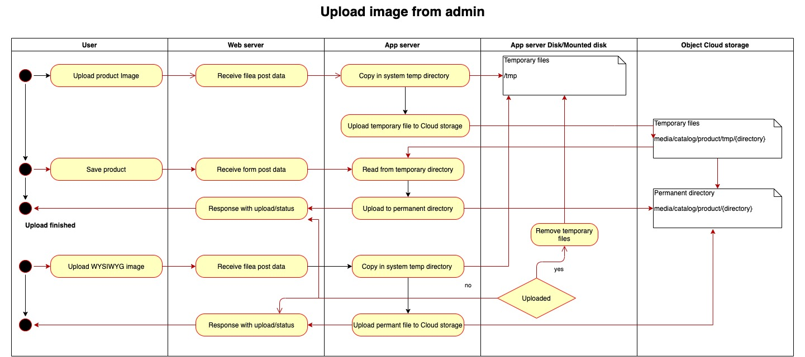
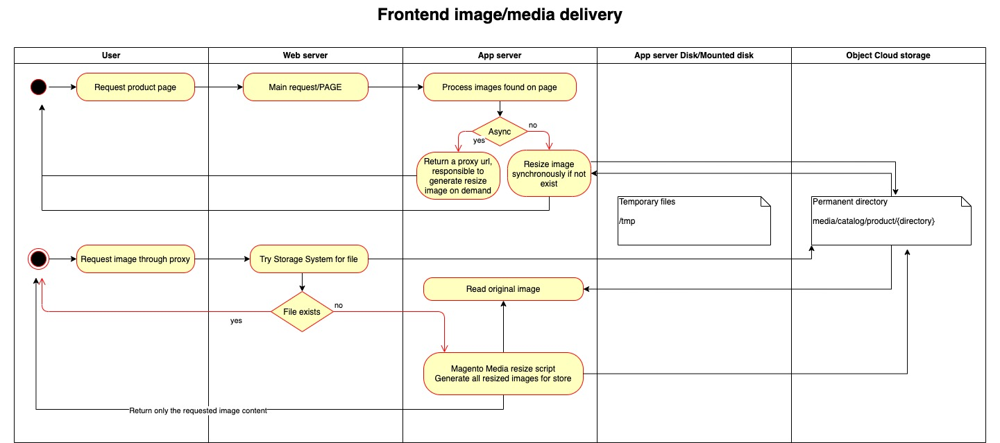

****************
Architecture
****************

.. include:: ./../messages.rst

.. note::
    Before going deeper into the development details, please note that the this Magento 2 module is extending core module interfaces, keeping in mind the backward compatibility and keeping the changes as low asa possible.

.. contents:: Table of Contents

Software architecture
=====================

Magento extension architecture
------------------------------

Upload images in admin area
^^^^^^^^^^^^^^^^^^^^^^^^^^^

Uploading files form user interfaces or programmatically at product should be compatible with any customization as log as is using Magento standard interfaces.

Nevertheless the business logic is not changed, and cloud storage services are added using regular/local filesystem interface.

.. note::
    Uploading products attachments for downloadable products works just like uploading the product image showed in the above schema.

.. note::
    Features: :term:`WOOB` :term:`v0.0.1`

Frontend resized image delivery
^^^^^^^^^^^^^^^^^^^^^^^^^^^^^^^

Resized images could be delivered directly from storage system after creating the resized image in the main request or return a proxy url responsible to return the image if not exist.

The proxy can be implemented as follow:

* nginx config to request it from storage system and create a fallback request in case of error on Magento resize script
* in case you don't have access to a web server proxy configuration there is a option to return it directly from default Magento image resize script.

.. note::
    :term:`SWSCNO` :term:`v0.0.1`

Frontend image delivery for original images
^^^^^^^^^^^^^^^^^^^^^^^^^^^^^^^^^^^^^^^^^^^

Original images could be delivered directly from storage system, or the CDN in front of it, by configuring the base media url in admin configuration under Store -> Configuration.

.. note::
    :term:`WOOB` :term:`v0.0.1`

Infrastructure architecture
============================

Ideal infrastructure setup
--------------------------

Possible optimization
---------------------

