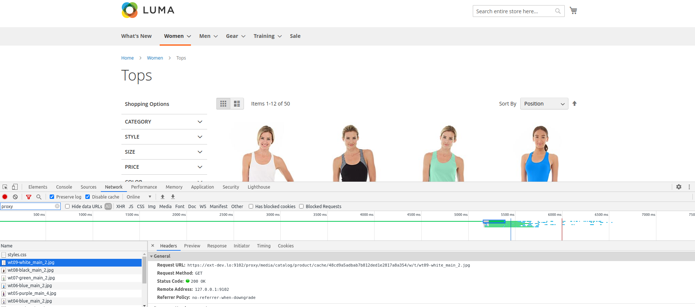
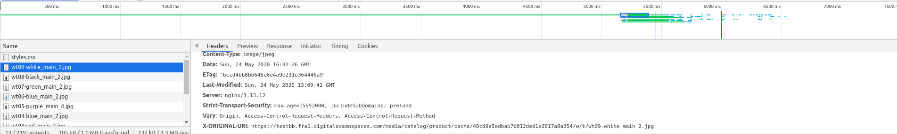

************
Demo
************

.. include:: messages.rst
.. contents:: Table of Contents

Backend
==============================

Speaking about website management panel, the way admin user will interact with website will not be changed, in any meaner:

* no other request will be made then the Magento core ones
* no other data are transferred to server, or stored in database
* no synchronization needed beside the first setup synchronization
* no duplicate media files will be saved once application si successfully configured

:term:`NEXT_MINOR_RELEASE`
Even if the extension will be configured by environment configuration there is a monitoring panel in admin, where admin users can perform basic checks of configuration setup and visualize statistics about the setup.

Frontend
==============================

Images delivery
---------------

As already presented there are two types of static files:

* resized/processed images that should be delivered using a proxy that can grab the original version of image process it, save the result into storage service for later use and return

* in debug mode you can see the reference to actual needed image from cloud

* as an optimization the images delivered without any processing can be delivered by public link of the storage service.

.. image:: _static/demo/serve-images-from-cloud.png
  :height: 300px
  :alt: Frontend demo mapping

CDN delivery
------------

No meter the case the solution can always contain a CDN (content delivery network) to optimize the download speed and even more avoid hitting the website infrastructure.

This can be configured from Store -> Configuration as media base host, which will look further to the described proxy above.

