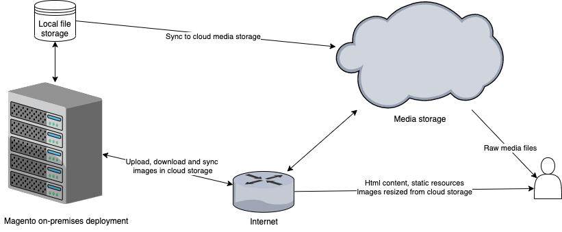
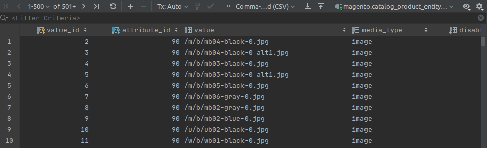
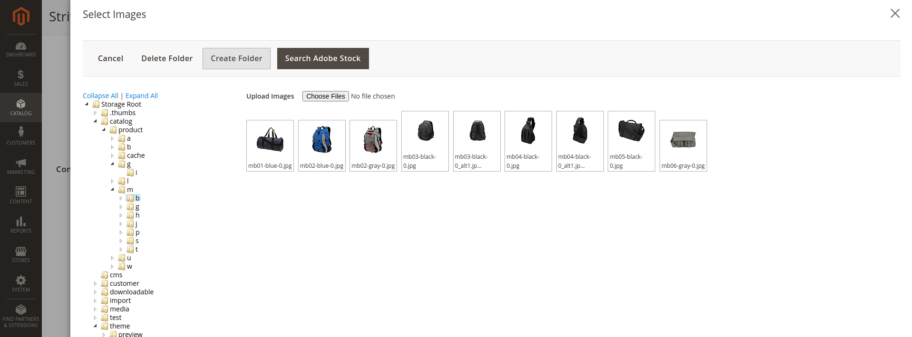
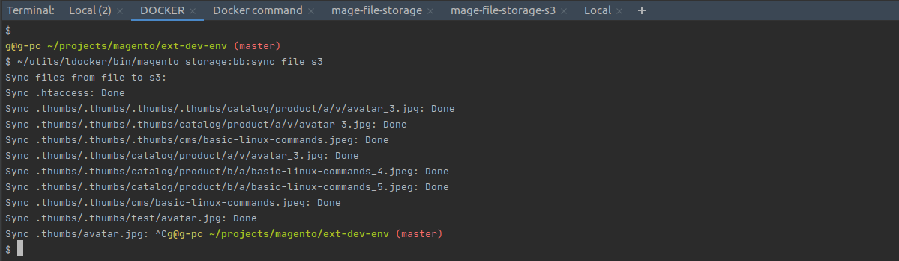

.. meta::
    :description lang=en:
        Details on setting up the cloud storage services integration for Magento 2

.. meta::
    :keywords lang=en:
        file storage service, cloud, integration, setup, configuration, magento, details

********************************
Implementation details
********************************

Storing static files inside the compute system involves some work when you decide to scale horizontally, but having all static files stored in a cloud object storage service (as an external "microservice") could ease the deployment process, in the same time reducing the complexity and improving the performance of the system.
You can check :ref:`some application architectures <extension/architecture>` to guide you to the proper solution for your use case.

For example:
    * storing CMS media files directly in a cloud object storage (like Amazon S3 or Azure Files) without touching the server disk could be achieved with little effort :ref:`explained here <cms>`.
    * all files that are served raw could easily be served directly from there or through a built-in or third-party CDN.
    * products media files could also be stored in a cloud object storage, but in this case, the resized images could be served through a reverse proxy server with fallback on the resizing endpoint.
    * even better, you can extract web asset storing and processing (eg: image resizing, compression) features as a microservice and reduce the Magento complexity.

There are plenty of cloud object storage services (for static files) offered with various features, all having common features like:

    * allow secure upload remotely of files
    * deliver public or private static files
    * built-in Content Delivery Network (CDN)

With this idea in mind, you can identify some advantages of using it in e-commerce websites for storing images and videos for products, categories, or CMS pages. Storing private content like downloadable products could be also covered.

`Read more about Magento 2 headless implementation. <https://magento.com/blog/best-practices/future-headless/>`_

.. include:: messages.rst

Use cases
=========

Extracting static files storage component as a microservice
-----------------------------------------------------------

There are few questions that could be raised related to the subject and the actual need for trading Magento builtin media storage based on local disk for a microservice specialized in web asset management.

Having microservice responsible for storage, processing, and delivery of all static content is a happy case that allows developers to focus on scaling independently compute and storage systems.

Also, having a specialized microservice in storing and delivering static files, allows improving this area independently. It is clear now, that this may be a big plus because website performance affects customer experience, conversions, and advertisement costs. (lately, advertisers are more and more careful about website performance)

:ref:`Read more about Magento Files Storage as a Microservice for Magento 2. <mss>`

`Subscribe for news related to media storage microservice for Magento 2. <https://magento.asset42.com/file-storage-service>`_

On premises deployment with cloud file storage and CDN in cloud
---------------------------------------------------------------

Even if this is not the lucky case this module could be used for this use-case, but some latency problems may occur on the admin panel.

This scenario implies storing media files using remote cloud services and process images on the application server.

.. image:: _static/on-premises-deployment.png
  :alt: On premises deployment

.. note::
    Optimization could be achieved if the resize script could be moved in the same data-center with media storage service.

Migration to cloud from on premises infrastructure
--------------------------------------------------

In the migration stage, this module could be used as a way to migrate media files to cloud storage service, and continue using them from there.

Existing deployment in cloud
----------------------------------

.. note::
    All notes above apply to this case, and the advantage of having the storage system and computing ones in the same data-center will assure best performance and cost-effective setup.

Features
========

Product file storage
--------------------

Images in the gallery, product description images, or other product-related photos will be stored at upload time in the cloud and delivered from there each time is needed in frontend.

Downloadable product attachments are supported by installing Bb_StorageDownloadable.

.. image:: _static/features/product-gallery.png
  :height: 300px
  :alt: Product file storage for gallery

Nothing changes in database architecture and the way Magento save path to product images.

Photo upload and management in admin
------------------------------------

The extension implements cloud storage folders navigation for admin users in order to allow users to locate files directly on storage service and insert them into HTML without the need of being on application servers.

WYSIWYG images storage
----------------------

In this area, images are stored in the cloud, and serve directly from there without processing or resizing.

:term:`OOB` See the image below, to prove nothing change in the way content is saved. Url is still saved as a relative path to media directory.

.. image:: _static/features/wysiwyg-standard-features.png
  :height: 300px
  :alt: WYSIWYG images storage

Sync command between filesystems
---------------------------------

For migration projects, there is a command to synchronize media files from one filesystem to another.

.. code-block:: shell

    bin/magento bb:storage:sync

    Description:
      Sync media files between two filesystems on a particular directory.

    Usage:
      bb:storage:sync [options] [--] <source> <destination> [<directory>]

    Arguments:
      source                Origin filesystem code
      destination           Destination filesystem code
      directory             Directory to be synchronized.

    Options:
      -o, --overwrite       Overwrite files in destination

Report differences between filesystems
--------------------------------------

:term:`future work`

Also for later use, there is a developer command to report the differences between two filesystems in order to re-evaluate the migration process.

.. code-block:: shell

    bin/magento bb:storage:diff files s3 media

    Description:
      Create a report with differences between different two filesystems on a particular directory.

    Usage:
      bb:storage:diff <filesystem_1> <filesystem_2> <directory>

    Arguments:
      filesystem_1          First filesystem code
      filesystem_2          Second filesystem code
      directory             Directory to be compared

Multiple cloud locations mapping for subdirectories
------------------------------------------------------

Having multiple cloud objects buckets mapped to different media level directories allow websites to expose files with different levels of permission for frontend. For example for downloadable products, files should always be served through the application server in order to check permissions, not directly from storage service.

.. _known_issues:

Known issues
============

Overwriting the Magento media location (or another core directory) may cause some errors in modules not consistently using \\Magento\\Framework\\Filesystem for directory and file operations (including Magento Core modules).

In some cases, operations on files or directories are performed directly with PHP functions, or \\Magento\\Framework\\Filesystem\\DriverInterface objects are obtained directly from ObjectManager. Obtaining a driver object form the filesystem object will avoid this type of problem.

Most of the inconsistencies from Magento core modules are fixed in Bb_StorageCms, Bb_StorageCatalog, Bb_StorageDownloadable modules, and is part of the plan to include these improvements in the Magento Community project.

However overwriting the Magento core directories is not mandatory, because you can configure new directories for custom implementation with the base module Bb_Storage and the module implementing the driver of your choice eg: Bb_StorageS3.

This module is not yet compatible with New Magento Media Gallery.

Latest releases
===============

.. note::

    This extension is currently an active development phase, check :ref:`Project Roadmap <roadmap>` to see some ideas or ask for solutions on a particular use case.

    .. important::

        * Feel free to create new issues for: feature requests, questions, new ideas, and improvements or bugs related to this extensions: `On GitHub <https://github.com/georgebabarus/magento-filesystem-extension/issues>`_

    1.0.0 - proof of concept
          - Bb_Storage could be installed independently and will allow custom/new directories for new modules
          - To overwrite the Magento storage following modules should be installed (are dependent on each other for now): Bb_StorageOverwrite, Bb_StorageCms, Bb_StorageCatalog, Bb_StorageDownloadable
          - For now, When you create a mapping for a subdirectory, you need to create a configuration for all others subdirectories
          - Available driver Bb_StorageS3 for Amazon S3 like integration. More drivers will be published soon depending on demands. Please request new drivers `on GitHub <https://github.com/georgebabarus/magento-filesystem-extension/issues>`_.

Useful links
=============

Read more about Object Storage services online:

* Amazon Simple Storage Service S3
    https://docs.aws.amazon.com/s3/index.html
* Azure Cloud File Storage/Blob storage
    https://azure.microsoft.com/en-us/services/storage/blobs
* Google Cloud Storage
    https://cloud.google.com/storage
* Digital Ocean Block Storage
    https://www.digitalocean.com/products/block-storage/
* Linode Object storage
    https://www.linode.com/products/object-storage/

Read more about CDN:

* Amazon CloudFront
    https://aws.amazon.com/cloudfront/
* Azure CDN
    https://docs.microsoft.com/en-us/azure/cdn/
* Akamai
    https://www.akamai.com/

.. include:: ./all-pages/available-links.rst
