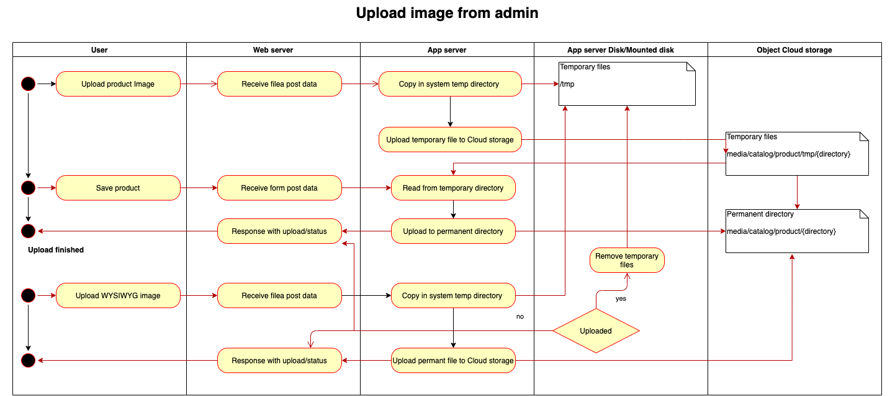

.. _extension/architecture:

.. meta::
    :description lang=en:
        File Storage Architecture abstraction in Magento 2 for better file storage integration interface: more extensible and reusable.

.. meta::
    :keywords lang=en:
        Magento 2, architecture, extension, abstraction

****************
Architecture
****************

Find some ideas related to Magento architecture and the possible solutions for extracting static files to an external filesystem service.

Take this architecture documentation page as a guideline, and not as a part provided by these extensions.

.. include:: ./../messages.rst

.. note::
    Before going deeper into the development details, please note that this Magento 2 module is extending core module interfaces, keeping in mind the backward compatibility and keeping the breaking changes as low as possible.

.. contents:: Table of Contents

Software architecture
=====================

Magento extension architecture
------------------------------

Upload images in the admin area
^^^^^^^^^^^^^^^^^^^^^^^^^^^^^^^

Uploading files form user interfaces or programmatically should be compatible with any customization as log as is using Magento standard interfaces and Filesystem object to obtain it.

Nevertheless, the business logic is not changed, and cloud storage services are integrated using a regular/local filesystem interface.

.. note::
    Uploading product attachments for downloadable products work just like uploading the product image shown in the above schema.

Resized image delivery
^^^^^^^^^^^^^^^^^^^^^^

Resizing images could be performed on the Magento /media path similar to the case when files were on disk. The difference is that, for directories mapped to cloud storage, files will be loaded using the proper driver for the service.

A better way could be to have this path behind a reverse proxy configuration. A sample configuration is provided for Nginx server.

The proxy can be implemented as follow:

    * try to deliver the file from the storage system by a proxy_pass call
    * when missing try to process the image using Magento standard path /media/*
    * save the result to the storage system
    * send the file to user

.. image:: _static/architecture/frontend-image-delivery.png
  :alt: Upload image for product or CMS blocks

Frontend image delivery for original images
^^^^^^^^^^^^^^^^^^^^^^^^^^^^^^^^^^^^^^^^^^^

Original images could be delivered directly from the storage system, or the CDN in front of it, by configuring the base media URL in admin configuration under Store -> Configuration.

There is a known limitation here for using multiple storage containers for mapping existing media directory because the URL for cms blocks and page is constructed using the base same URL as product images.
This means, for now, the core media directory could be mapped to only one remote directory, CMS, and product page should reside in the same cloud storage container.

Infrastructure architecture
============================

Basic infrastructure setup
--------------------------

.. image:: _static/architecture/basic-infrastructure-architecture.png
  :alt: Basic infrastructure architecture

Possible optimization
---------------------

.. image:: _static/architecture/infrastructure-architecture-improved.png
  :alt: Infrastructure architecture improved

.. include:: ./../all-pages/available-links.rst
