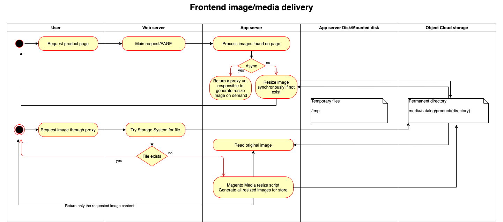
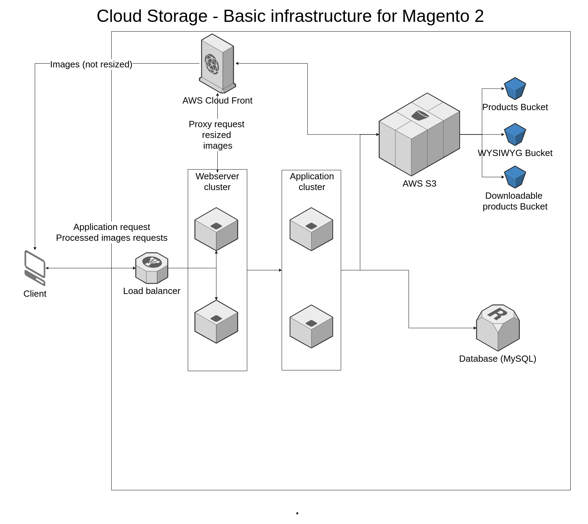
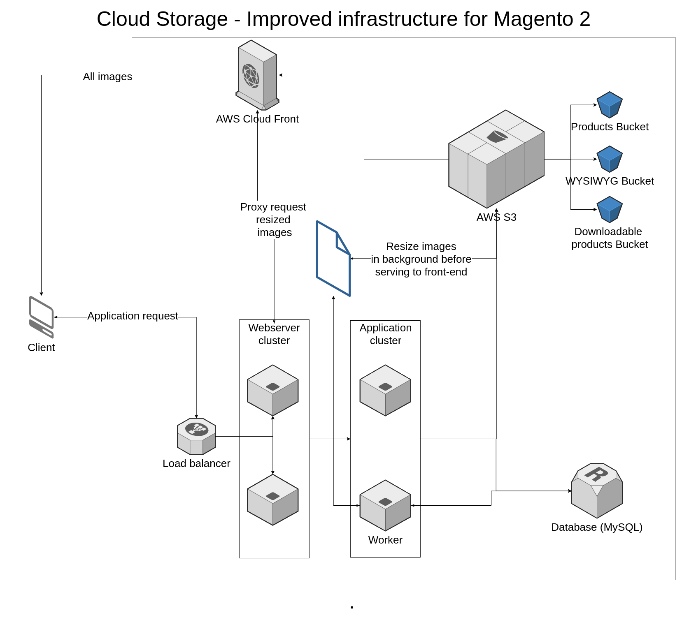

.. _extension/architecture:

.. meta::
    :description lang=en:
        Magento 2 File Storage Architecture abstraction for better file storage integration interface: more extensible and reusable.

.. meta::
    :keywords lang=en:
        Magento 2, architecture, extension, abstraction

****************
Architecture
****************

Find some ideas related to Magento architecture and the possible solutions for extracting static files to a external filesystem service.

Take this architecture documentation page as a guideline, and not as a part provided by this extensions.

.. include:: ./../messages.rst

.. note::
    Before going deeper into the development details, please note that the this Magento 2 module is extending core module interfaces, keeping in mind the backward compatibility and keeping the changes as low asa possible.

.. contents:: Table of Contents

Software architecture
=====================

Magento extension architecture
------------------------------

Upload images in admin area
^^^^^^^^^^^^^^^^^^^^^^^^^^^

Uploading files form user interfaces or programmatically should be compatible with any customization as log as is using Magento standard interfaces.

Nevertheless the business logic is not changed, and cloud storage services are integrated using regular/local filesystem interface.

.. image:: _static/architecture/upload-image.png
  :alt: Upload image for product or CMS blocks

.. note::
    Uploading products attachments for downloadable products works just like uploading the product image showed in the above schema.

Resized image delivery
^^^^^^^^^^^^^^^^^^^^^^

Resizing images could be performed on magento /media path similar with the case when files were on disk. The difference is that for mapped directories to a cloud storage, now, will read the files using the proper driver.

A better way could be to have this path behind a reverse proxy configuration. Sample configuration is provided for nginx server.

The proxy can be implemented as follow:

    * try to deliver the file from storage system by a proxy_pass call
    * when missing try to process the image using Magento standard path /media/*
    * save result to storage system
    * return to user

Frontend image delivery for original images
^^^^^^^^^^^^^^^^^^^^^^^^^^^^^^^^^^^^^^^^^^^

Original images could be delivered directly from storage system, or the CDN in front of it, by configuring the base media url in admin configuration under Store -> Configuration.

Infrastructure architecture
============================

Ideal infrastructure setup
--------------------------

Possible optimization
---------------------

