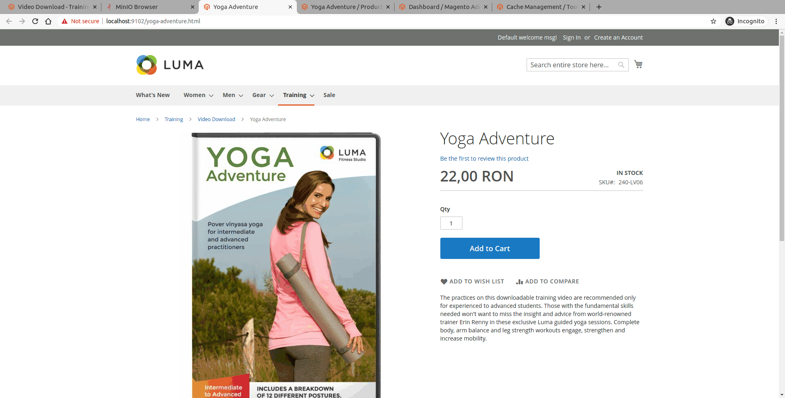
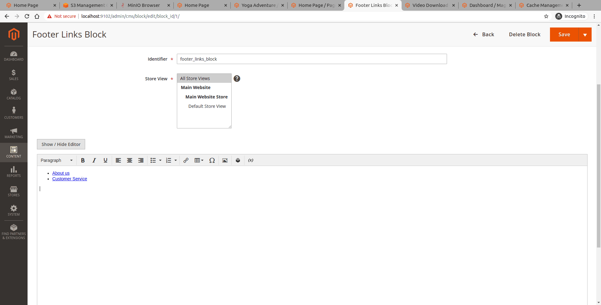

.. _demo:

.. meta::
    :description lang=en:
        File Storage Demo of Amazon S3 storage integration into Magento 2.

.. meta::
    :keywords lang=en:
        Magento 2, demo, integration, amazon s3, azure file storage, blob storage

************
Demo
************

This demo page will guide you through main features affected by media files relocation. In this scenario the extension is configured to map pub/media file to external filesystem.

Even if there are some configuration needed, maybe some changes in codebase, the overall system should become more robust after a proper configuration.

Keep in mind that depending on the implementation of a 3rd party extension it may brake during the configuration of magento core directories mapping to external filesystems.

.. include:: ./../messages.rst
.. contents:: Table of Contents

Backend
==============================

Speaking about website management panel, the way admin user will interact with website will not be changed, in any meaner:

* no other request will be made then the Magento core ones
* no extra data is transferred to server, or stored in database
* no synchronization needed beside the first setup synchronization
* no duplicate media files will be saved once application si successfully configured

:term:`NEXT_MINOR_RELEASE`
Even if the extension will be configured by environment configuration there is a monitoring panel in admin, where admin users can perform basic checks of configuration setup and visualize statistics about the setup.

Frontend
==============================

Images delivery
---------------

As already discussed, with this modules we manage two types of images:

* resized/processed images that should be delivered using a proxy that can grab the original version of image process it, save the result into storage service for later use and return

    .. image:: _static/demo/frontend-demo.png
      :height: 300px
      :alt: Frontend demo

    * if debug mode is configured in proxy configuration, you can see that the request goes to actual needed image from cloud

    .. image:: _static/demo/cloud-storage-mapping.png
      :height: 300px
      :alt: Frontend demo mapping

* raw images delivered without any processing and can be delivered by public link of the storage service.

    .. image:: _static/demo/serve-images-from-cloud.png
      :height: 300px
      :alt: Frontend demo mapping

CDN delivery
------------

No meter the case you are in, the solution can always contain a CDN (content delivery network) to optimize the download speed and even more avoid hitting the website infrastructure.

Files Storage Microservice
--------------------------

:ref:`Read more about Files Storage Microservice for Magento 2. <mss>`

Extension in action
====================

Bellow you can see a test setup that will prove versatility of this extensions group.

You will find all key features explained during this documentation in few images, to better understand the use case.

Keep in mind that during this demo session the local disk of application server is never touched in media directory, all files are stored in configured storage service:

    * products images and cms pages and blocks images are stored in local Minio storage service
    * downloadable products attachments are stored in Amazon S3, private bucket

Catalog product image
---------------------

Update catalog product image directly in Minio - compatible with S3 API  media storage service.

Resized images are served on demand directly from storage service, without checking application local disk.

.. image:: _static/gif/product-resized-image-cache.gif
  :height: 300px
  :alt: Catalog product edit

Downloadable attachments on products
------------------------------------

Downloadable product attachments are saved in Amazon S3 storage service, in a private bucket.

.. image:: _static/gif/downloadable-products.gif
  :height: 300px
  :alt: Downloadable product files

Products CMS content
---------------------

See the direct url of the image saved in Mino storage service, and the relative path used in admin panel.

.. image:: _static/gif/product-cms.gif
  :height: 300px
  :alt: Product cms images

CMS pages content
-----------------

Images in CMS pages are only saved in storage service, and served using the public URL of the storage service.

.. image:: _static/gif/cms-pages-images.gif
  :height: 300px
  :alt: Cms pages images

CMS blocks content
------------------

