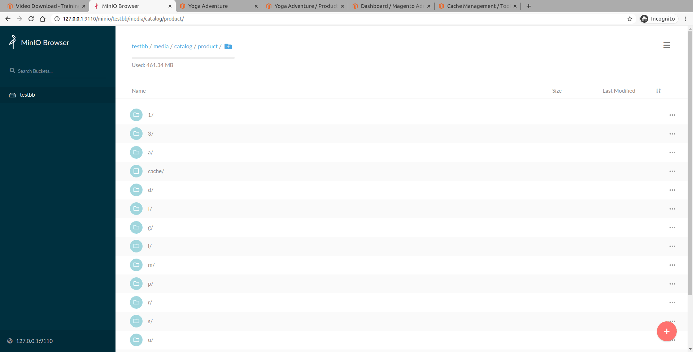

.. meta::
    :description lang=en:
        Catalog product edit Demo of Amazon S3 storage integration into Magento 2.

.. meta::
    :keywords lang=en:
        Magento 2, demo, integration, amazon s3, azure file storage, blob storage

Catalog product image
---------------------

Update catalog product image directly in Minio - compatible with S3 API  media storage service.

.. image:: ./../_static/gif/catalog-product-photo.gif
  :height: 300px
  :alt: Catalog product edit

Resized images are served on-demand directly from storage service, without checking the application local disk.

