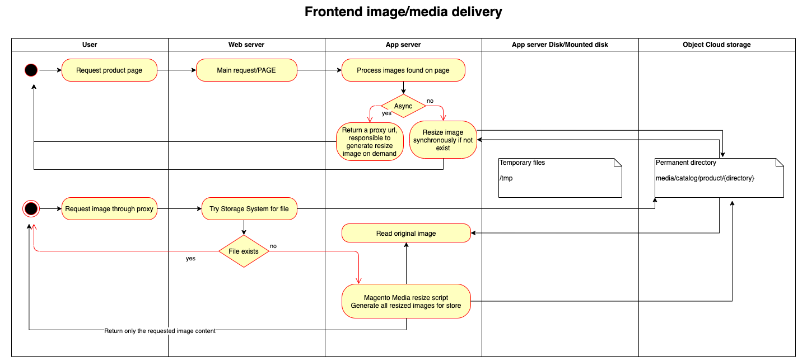

.. _mss:

.. meta::
    :description lang=en:
        Magento 2 Media Storage Service in a Microservice based architecture

.. meta::
    :keywords lang=en:
        Magento 2, file storage, service, cloud storage, microservice

.. toctree::
    :caption: Storage Service for Magento 2
    :maxdepth: 2

    media-storage-service

***********************
STORAGE SERVICE (A42SS)
***********************

Asset42 Storage Service for Magento 2 (A42SS) is a software as a service (SaaS) project providing file storage integration with cloud object storage services and CDN for Magento 2 stores.

Most often Magento media files are served from a content delivery network (CDN) to optimize loading time for these files and reducing network throughput rate on the compute servers. In the given situation there is one open question: Should media files still reside on the compute server's disk? (being regular disk or mounted object storage service). Now consider recent plans for `Magento 2 related headless implementation <https://magento.com/blog/best-practices/future-headless/>`_ and the answer may be clear.

This integration will allow shop owners to store media files in a cloud storage service and using a CDN, and at the same time reducing the complexity of the Magento 2 system by extracting media storage as a microservice.

This M2SS service is in charge of:
    * storing any type of media file (in object storage service of various cloud providers)
    * resizing images on-demand or in the background after upload
    * serve optimized resources using CDN

Magento project will use the Remote Filesystem Integration extension to write media files directly to the cloud storage service of choice by using the proper driver for the service.

After the image uploaded, no other requests are made to the storage service, the URL is generated in Magento but the resource is only served from MSS.

Subscribe for news on this topic
=================================

Subscribe for updates on this topic and information about the release of the next Storage Service for Magento 2.

Soon we will come with a beta program and you may benefit from attractive enrolment discounts.

`Subscribe here <https://magento.asset42.com/file-storage-service/>`_

Architecture
============

.. include:: ./all-pages/available-links.rst
